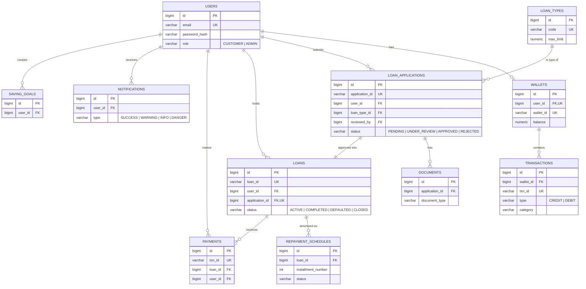

# LoanPro — Database

PostgreSQL 15+ schema for the LoanPro Loan Management System.

> The application runs with Hibernate `ddl-auto=update`, so tables are created
> automatically from the JPA entities on first startup. The files here are a
> hand-maintained mirror for documentation, manual provisioning, and review.

## Files

| File | Purpose |
|------|---------|
| [`schema.sql`](schema.sql) | Full DDL — all 11 tables, constraints, and indexes |
| [`seed_data.sql`](seed_data.sql) | Default admin/customer accounts, wallet, and loan types |

## Provisioning manually

```bash
createdb loanpro_db
psql -d loanpro_db -f database/schema.sql
psql -d loanpro_db -f database/seed_data.sql
```

If you instead let the app create the schema, only `seed_data.sql`/`data.sql`
is needed (Spring Boot runs `data.sql` automatically).

## Default accounts

| Email | Password | Role |
|-------|----------|------|
| `admin@loanpro.com` | `admin123` | ADMIN |
| `nimal@gmail.com` | `customer123` | CUSTOMER |

## Entity-Relationship Diagram



> `loan_applications.reviewed_by` is a second FK to `users` (the admin who
> reviewed the application), in addition to `user_id` (the applicant).

## Tables at a glance

| Table | Description |
|-------|-------------|
| `users` | CUSTOMER and ADMIN accounts; implements Spring Security `UserDetails` |
| `wallets` | One per user, auto-created on registration |
| `transactions` | Every credit/debit against a wallet |
| `loan_types` | Product catalog (Personal, Business, Home, Vehicle) |
| `loan_applications` | Full 5-step application form + admin decision fields |
| `documents` | Uploaded file metadata linked to an application |
| `loans` | Created on approval; 1:1 with the originating application |
| `repayment_schedules` | One row per installment (amortization table) |
| `payments` | Actual EMI payments made by customers |
| `notifications` | In-app notifications |
| `saving_goals` | Customer-created saving targets shown on the wallet page |

## Enumerations

Stored as `VARCHAR` (Hibernate `EnumType.STRING`):

| Enum | Values |
|------|--------|
| `Role` | `CUSTOMER`, `ADMIN` |
| `ApplicationStatus` | `PENDING`, `UNDER_REVIEW`, `APPROVED`, `REJECTED` |
| `LoanStatus` | `ACTIVE`, `COMPLETED`, `DEFAULTED`, `CLOSED` |
| `PaymentStatus` | `PAID`, `NEXT_DUE`, `PENDING`, `OVERDUE`, `FAILED` |
| `TransactionType` | `CREDIT`, `DEBIT` |
| `TransactionCategory` | `EMI_PAYMENT`, `TOP_UP`, `TRANSFER`, `WITHDRAWAL`, `CASHBACK` |
| `NotificationType` | `SUCCESS`, `WARNING`, `INFO`, `DANGER` |
