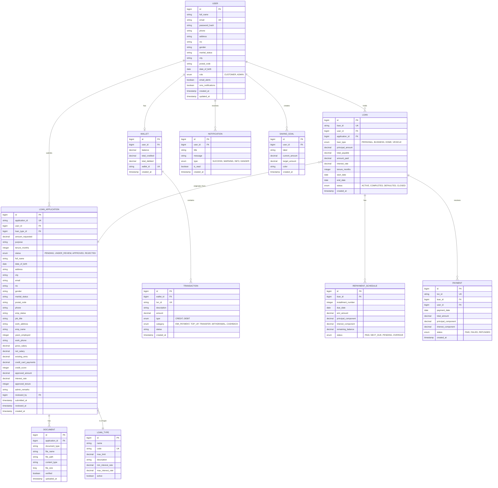

# LoanPro — Spring Boot Backend Implementation Plan

The LoanPro frontend (React + Vite) is fully built with mock data. This plan covers building the complete Spring Boot backend to replace all mock data with real APIs backed by PostgreSQL.

---

## User Review Required

> [!IMPORTANT]
> **Database choice**: The root README states PostgreSQL. This plan assumes PostgreSQL 15+. Confirm if you want a different version or a different RDBMS.

> [!IMPORTANT]
> **Java version**: This plan targets **Java 17** with **Spring Boot 3.3.x**. Confirm if you need a different version.

> [!IMPORTANT]
> **Authentication strategy**: This plan uses **JWT (JSON Web Token)** based stateless authentication with Spring Security. The frontend currently uses a fake login — the backend will provide real token-based auth. Confirm if you prefer session-based auth instead.

> [!WARNING]
> **File uploads**: The loan application flow requires document uploads (NIC, bank statements, salary slips, tax returns). This plan stores files on the **local filesystem** (`uploads/` directory). For production, you may want to switch to cloud storage (AWS S3, GCS). Confirm your preference.

---

## Open Questions

> [!IMPORTANT]
> **Payment gateway integration**: The Wallet has Top-up, Transfer, and Withdraw buttons. Should these connect to a real payment gateway (e.g., Stripe, PayHere), or should they remain internal wallet operations for now?

> [!IMPORTANT]
> **Email/SMS notifications**: The frontend shows notification preferences (Email Alerts, SMS Notifications). Do you want actual email (SMTP/SendGrid) and SMS (Twilio) integration, or just in-app notifications stored in the database for Phase 1?

> [!IMPORTANT]
> **Credit score**: The admin review page shows a credit score (720). Should this be a manually entered field, or do you want integration with an external credit bureau API?

> [!IMPORTANT]
> **Currency**: The app uses LKR (Sri Lankan Rupee). Confirm this is the only currency needed (no multi-currency support).

---

## Project Architecture Overview

```
d:\Intern\Loan_Management_System\backend\
└── loanpro-backend/
    ├── src/main/java/com/loanpro/
    │   ├── LoanProApplication.java              ← Main entry point
    │   ├── config/                               ← Security, CORS, file upload config
    │   │   ├── SecurityConfig.java
    │   │   ├── CorsConfig.java
    │   │   ├── JwtAuthFilter.java
    │   │   └── FileUploadConfig.java
    │   ├── controller/                           ← REST API controllers
    │   │   ├── AuthController.java
    │   │   ├── UserController.java
    │   │   ├── LoanApplicationController.java
    │   │   ├── LoanController.java
    │   │   ├── RepaymentController.java
    │   │   ├── WalletController.java
    │   │   ├── TransactionController.java
    │   │   ├── NotificationController.java
    │   │   ├── DocumentController.java
    │   │   └── AdminDashboardController.java
    │   ├── dto/                                  ← Request/Response DTOs
    │   │   ├── request/
    │   │   │   ├── LoginRequest.java
    │   │   │   ├── RegisterRequest.java
    │   │   │   ├── LoanApplicationRequest.java
    │   │   │   ├── LoanDecisionRequest.java
    │   │   │   ├── WalletTopUpRequest.java
    │   │   │   ├── WalletTransferRequest.java
    │   │   │   ├── ProfileUpdateRequest.java
    │   │   │   └── PasswordChangeRequest.java
    │   │   └── response/
    │   │       ├── AuthResponse.java
    │   │       ├── UserProfileResponse.java
    │   │       ├── LoanApplicationResponse.java
    │   │       ├── LoanDetailResponse.java
    │   │       ├── RepaymentScheduleResponse.java
    │   │       ├── WalletResponse.java
    │   │       ├── TransactionResponse.java
    │   │       ├── NotificationResponse.java
    │   │       ├── AdminDashboardResponse.java
    │   │       ├── AdminStatsResponse.java
    │   │       └── ApiResponse.java
    │   ├── entity/                               ← JPA Entities
    │   │   ├── User.java
    │   │   ├── Wallet.java
    │   │   ├── Transaction.java
    │   │   ├── LoanType.java
    │   │   ├── LoanApplication.java
    │   │   ├── Loan.java
    │   │   ├── RepaymentSchedule.java
    │   │   ├── Payment.java
    │   │   ├── Document.java
    │   │   ├── Notification.java
    │   │   └── SavingGoal.java
    │   ├── enums/                                ← Enum types
    │   │   ├── Role.java
    │   │   ├── ApplicationStatus.java
    │   │   ├── LoanStatus.java
    │   │   ├── PaymentStatus.java
    │   │   ├── TransactionType.java
    │   │   └── NotificationType.java
    │   ├── repository/                           ← Spring Data JPA Repositories
    │   │   ├── UserRepository.java
    │   │   ├── WalletRepository.java
    │   │   ├── TransactionRepository.java
    │   │   ├── LoanTypeRepository.java
    │   │   ├── LoanApplicationRepository.java
    │   │   ├── LoanRepository.java
    │   │   ├── RepaymentScheduleRepository.java
    │   │   ├── PaymentRepository.java
    │   │   ├── DocumentRepository.java
    │   │   ├── NotificationRepository.java
    │   │   └── SavingGoalRepository.java
    │   ├── service/                              ← Business logic services
    │   │   ├── AuthService.java
    │   │   ├── UserService.java
    │   │   ├── LoanApplicationService.java
    │   │   ├── LoanService.java
    │   │   ├── RepaymentService.java
    │   │   ├── WalletService.java
    │   │   ├── TransactionService.java
    │   │   ├── NotificationService.java
    │   │   ├── DocumentService.java
    │   │   ├── AdminDashboardService.java
    │   │   ├── EmCalculationService.java
    │   │   └── JwtService.java
    │   ├── exception/                            ← Custom exceptions & handler
    │   │   ├── GlobalExceptionHandler.java
    │   │   ├── ResourceNotFoundException.java
    │   │   ├── BadRequestException.java
    │   │   ├── UnauthorizedException.java
    │   │   └── InsufficientFundsException.java
    │   └── util/                                 ← Utility classes
    │       └── AmortizationCalculator.java
    ├── src/main/resources/
    │   ├── application.properties
    │   ├── application-dev.properties
    │   └── data.sql                              ← Seed data (loan types, admin user)
    ├── src/test/java/com/loanpro/
    │   ├── controller/
    │   ├── service/
    │   └── repository/
    └── pom.xml
```

---

## Proposed Changes

### Phase 1: Project Initialization & Configuration

#### [NEW] [pom.xml](file:///d:/Intern/Loan_Management_System/backend/loanpro-backend/pom.xml)

Maven project with these dependencies:
- `spring-boot-starter-web` — REST API
- `spring-boot-starter-data-jpa` — ORM / Database
- `spring-boot-starter-security` — Authentication & Authorization
- `spring-boot-starter-validation` — Bean validation (`@Valid`, `@NotBlank`, etc.)
- `postgresql` — PostgreSQL JDBC driver
- `jjwt-api`, `jjwt-impl`, `jjwt-jackson` (io.jsonwebtoken 0.12.x) — JWT token handling
- `lombok` — Reduce boilerplate
- `spring-boot-starter-test` — Testing
- `spring-security-test` — Security testing
- `springdoc-openapi-starter-webmvc-ui` — Swagger API docs

#### [NEW] [application.properties](file:///d:/Intern/Loan_Management_System/backend/loanpro-backend/src/main/resources/application.properties)

```properties
# Server
server.port=8080

# PostgreSQL
spring.datasource.url=jdbc:postgresql://localhost:5432/loanpro_db
spring.datasource.username=postgres
spring.datasource.password=your_password

# JPA / Hibernate
spring.jpa.hibernate.ddl-auto=update
spring.jpa.show-sql=true
spring.jpa.properties.hibernate.dialect=org.hibernate.dialect.PostgreSQLDialect
spring.jpa.properties.hibernate.format_sql=true

# JWT
app.jwt.secret=your-256-bit-secret-key-here-minimum-32-chars
app.jwt.expiration-ms=86400000

# File Upload
spring.servlet.multipart.max-file-size=10MB
spring.servlet.multipart.max-request-size=50MB
app.upload.dir=uploads

# Swagger
springdoc.api-docs.path=/api-docs
springdoc.swagger-ui.path=/swagger-ui.html
```

#### [NEW] [LoanProApplication.java](file:///d:/Intern/Loan_Management_System/backend/loanpro-backend/src/main/java/com/loanpro/LoanProApplication.java)

Standard Spring Boot entry point with `@SpringBootApplication`.

---

### Phase 2: Database Schema & Entity Modeling

#### Entity-Relationship Diagram



#### [NEW] Entity Files — `entity/` package

| File | Description |
|------|-------------|
| `User.java` | Users table — `CUSTOMER` and `ADMIN` roles, implements `UserDetails` for Spring Security |
| `Wallet.java` | One-to-one with User, auto-generated `WLT-XXXX-XXX` wallet ID |
| `Transaction.java` | Wallet transactions (credits/debits) |
| `LoanType.java` | Loan product catalog (Personal, Business, Home, Vehicle) |
| `LoanApplication.java` | Full 5-step application data — personal, financial, employment info |
| `Document.java` | Uploaded documents linked to applications |
| `Loan.java` | Active/completed loans created after admin approval |
| `RepaymentSchedule.java` | Amortization table entries per loan |
| `Payment.java` | Actual EMI payments made by customers |
| `Notification.java` | In-app notifications |
| `SavingGoal.java` | Customer saving goals displayed on wallet page |

#### [NEW] Enum Files — `enums/` package

| File | Values |
|------|--------|
| `Role.java` | `CUSTOMER`, `ADMIN` |
| `ApplicationStatus.java` | `PENDING`, `UNDER_REVIEW`, `APPROVED`, `REJECTED` |
| `LoanStatus.java` | `ACTIVE`, `COMPLETED`, `DEFAULTED`, `CLOSED` |
| `PaymentStatus.java` | `PAID`, `NEXT_DUE`, `PENDING`, `OVERDUE`, `FAILED` |
| `TransactionType.java` | `CREDIT`, `DEBIT` |
| `NotificationType.java` | `SUCCESS`, `WARNING`, `INFO`, `DANGER` |

---

### Phase 3: Security & Authentication (JWT)

#### [NEW] [SecurityConfig.java](file:///d:/Intern/Loan_Management_System/backend/loanpro-backend/src/main/java/com/loanpro/config/SecurityConfig.java)

- Disable CSRF (stateless API)
- Permit `/api/auth/**` endpoints (login, register)
- Permit `/swagger-ui/**`, `/api-docs/**`
- Require `ADMIN` role for `/api/admin/**` endpoints
- Require authentication for all other `/api/**` endpoints
- Add `JwtAuthFilter` before `UsernamePasswordAuthenticationFilter`
- Configure `BCryptPasswordEncoder` as the password encoder

#### [NEW] [JwtService.java](file:///d:/Intern/Loan_Management_System/backend/loanpro-backend/src/main/java/com/loanpro/service/JwtService.java)

- `generateToken(User user)` → Creates JWT with claims: userId, email, role
- `validateToken(String token)` → Validates signature and expiration
- `extractEmail(String token)` → Extracts user email from token
- `extractClaims(String token)` → Extracts all claims

#### [NEW] [JwtAuthFilter.java](file:///d:/Intern/Loan_Management_System/backend/loanpro-backend/src/main/java/com/loanpro/config/JwtAuthFilter.java)

- `OncePerRequestFilter` implementation
- Extracts `Authorization: Bearer <token>` header
- Validates token and sets `SecurityContext` with authenticated user

#### [NEW] [CorsConfig.java](file:///d:/Intern/Loan_Management_System/backend/loanpro-backend/src/main/java/com/loanpro/config/CorsConfig.java)

- Allow origins: `http://localhost:5173` (Vite dev server), configurable via properties
- Allow methods: GET, POST, PUT, DELETE, PATCH, OPTIONS
- Allow headers: Authorization, Content-Type
- Allow credentials: true

---

### Phase 4: REST API Controllers & Service Layer

Below is the complete API specification matched to the frontend's needs.

---

#### 4.1 Authentication — `AuthController.java` + `AuthService.java`

| Method | Endpoint | Description | Frontend Page |
|--------|----------|-------------|---------------|
| `POST` | `/api/auth/register` | Register new customer | Register.jsx |
| `POST` | `/api/auth/login` | Login (returns JWT + user data) | Login.jsx |

**`POST /api/auth/register`** — Request body:
```json
{
  "fullName": "Nimal Perera",
  "email": "nimal@gmail.com",
  "password": "securePass123",
  "confirmPassword": "securePass123"
}
```

**`POST /api/auth/login`** — Request body:
```json
{
  "email": "nimal@gmail.com",
  "password": "securePass123"
}
```

**Response:**
```json
{
  "token": "eyJhbGciOi...",
  "user": {
    "id": 1,
    "name": "Nimal Perera",
    "email": "nimal@gmail.com",
    "role": "CUSTOMER"
  }
}
```

**Service logic:**
- Hash password with BCrypt on register
- Auto-create a Wallet for each new user (balance = 0, generate wallet ID like `WLT-2024-XXX`)
- Validate credentials on login, return JWT
- Support role toggle (Customer / Admin login — role is stored in DB, not selected at login)

---

#### 4.2 User Profile — `UserController.java` + `UserService.java`

| Method | Endpoint | Description | Frontend Page |
|--------|----------|-------------|---------------|
| `GET` | `/api/users/profile` | Get current user profile | UserProfile.jsx |
| `PUT` | `/api/users/profile` | Update profile details | UserProfile.jsx |
| `PUT` | `/api/users/password` | Change password | UserProfile.jsx |
| `PUT` | `/api/users/notifications-preferences` | Update notification prefs | UserProfile.jsx |

**`GET /api/users/profile`** — Response matches UserProfile.jsx:
```json
{
  "id": 1,
  "fullName": "Nimal Perera",
  "email": "nimal@gmail.com",
  "phone": "+94 77 123 4567",
  "address": "123 Galle Road, Colombo 03",
  "role": "CUSTOMER",
  "emailAlerts": true,
  "smsNotifications": true,
  "createdAt": "2024-01-15"
}
```

---

#### 4.3 Loan Application — `LoanApplicationController.java` + `LoanApplicationService.java`

| Method | Endpoint | Description | Frontend Page |
|--------|----------|-------------|---------------|
| `GET` | `/api/loan-types` | Get all loan types | ApplyForLoan.jsx (Step 1) |
| `POST` | `/api/applications` | Submit loan application | ApplyForLoan.jsx (Step 5) |
| `GET` | `/api/applications/my` | Get user's own applications | CustomerDashboard.jsx |
| `GET` | `/api/applications/{id}` | Get application details | ReviewApplication.jsx |

**`GET /api/loan-types`** — Response:
```json
[
  {
    "id": "personal",
    "title": "Personal Loan",
    "limit": "Up to LKR 500,000",
    "description": "For Personal expenses, medical, educational"
  },
  ...
]
```

**`POST /api/applications`** — Request body (matches 5-step form):
```json
{
  "loanType": "personal",
  "amountRequested": 100000,
  "purpose": "Home Renovation",
  "tenureMonths": 36,
  "fullName": "Nimal Perera",
  "dob": "1990-05-15",
  "address": "123 Galle Road",
  "city": "Colombo",
  "email": "nimal@gmail.com",
  "nic": "901234567V",
  "gender": "Male",
  "maritalStatus": "Single",
  "postalCode": "00300",
  "phone": "+94771234567",
  "empStatus": "Full-Time",
  "jobTitle": "Software Engineer",
  "workAddress": "456 Tech Park",
  "empName": "ABC Corp",
  "yearsEmp": 5,
  "workPhone": "+94112345678",
  "grossSalary": 120000,
  "netSalary": 95000,
  "existingEmis": 5000,
  "creditCard": 3000
}
```

**Service logic:**
- Auto-generate application ID: `APP-XXXX` format
- Set initial status to `PENDING`
- Calculate DTI ratio: `(existingEmis + creditCard + estimatedEMI) / grossSalary * 100`
- Timestamp the submission

---

#### 4.4 Document Upload — `DocumentController.java` + `DocumentService.java`

| Method | Endpoint | Description | Frontend Page |
|--------|----------|-------------|---------------|
| `POST` | `/api/applications/{appId}/documents` | Upload document | ApplyForLoan.jsx (Step 4) |
| `GET` | `/api/applications/{appId}/documents` | List documents | ReviewApplication.jsx |
| `GET` | `/api/documents/{id}/download` | Download a document | ReviewApplication.jsx |

**`POST /api/applications/{appId}/documents`**
- Multipart file upload
- Document types: `NIC_PASSPORT`, `PROOF_OF_INCOME`, `BANK_STATEMENT`, `TAX_RETURN`
- Store file on disk at `uploads/{appId}/{filename}`
- Save metadata (file name, path, type, size, verified=false) to DB

---

#### 4.5 Admin — Application Review — `LoanApplicationController.java` (admin endpoints)

| Method | Endpoint | Description | Frontend Page |
|--------|----------|-------------|---------------|
| `GET` | `/api/admin/applications` | List all applications (with filters) | LoanApplications.jsx |
| `GET` | `/api/admin/applications/{id}` | Get full application for review | ReviewApplication.jsx |
| `PUT` | `/api/admin/applications/{id}/decision` | Approve / Reject / Hold | ReviewApplication.jsx |

**`GET /api/admin/applications`** — Query params:
- `status` (optional): `PENDING`, `APPROVED`, `REJECTED`, `ALL`
- `search` (optional): search by name or app ID
- `page`, `size`: pagination

**Response matches `allApplications` in mockData:**
```json
{
  "content": [
    {
      "id": "APP-0234",
      "name": "Nimal Perera",
      "date": "Oct 12, 2024",
      "type": "Personal Loan",
      "amount": "LKR 80,000",
      "status": "Pending"
    }
  ],
  "totalPages": 1,
  "totalElements": 5
}
```

**`PUT /api/admin/applications/{id}/decision`** — Request body:
```json
{
  "decision": "APPROVED",
  "approvedAmount": 80000,
  "interestRate": 8.5,
  "tenure": 36,
  "remarks": "Good credit history. Approved."
}
```

**Service logic on APPROVED:**
1. Update application status to `APPROVED`
2. Create a new `Loan` entity with auto-generated ID (`LN-XXXXX`)
3. Call `EmiCalculationService` to calculate monthly EMI
4. Generate full `RepaymentSchedule` (amortization table) for all months
5. Debit the approved amount from the system (or credit to user wallet, depending on flow)
6. Create a `Notification` for the customer: "Your Personal Loan was approved!"

---

#### 4.6 Active Loans — `LoanController.java` + `LoanService.java`

| Method | Endpoint | Description | Frontend Page |
|--------|----------|-------------|---------------|
| `GET` | `/api/loans/active` | Get user's active loan | MyLoans.jsx, CustomerDashboard.jsx |
| `GET` | `/api/loans/{id}` | Get loan details | MyLoans.jsx |
| `GET` | `/api/loans/{id}/schedule` | Get amortization table | RepaymentSchedule.jsx |
| `GET` | `/api/loans/{id}/payments` | Get payment history for a loan | MyLoans.jsx (payment table) |

**`GET /api/loans/active`** — Response matches `myActiveLoan`:
```json
{
  "id": "LN-84729",
  "type": "Personal Loan",
  "status": "Active",
  "principal": 80000,
  "totalPayable": 85600,
  "amountPaid": 35000,
  "paidPercentage": 40,
  "interestRate": "8.5%",
  "tenure": "24 Months",
  "startDate": "Jan 15, 2024",
  "nextEmi": {
    "amount": 3566,
    "dueDate": "May 15, 2024",
    "daysLeft": 12
  }
}
```

**`GET /api/loans/{id}/schedule`** — Response matches `amortizationSchedule`:
```json
[
  {
    "month": 1,
    "date": "Jan 15, 2024",
    "emi": 3566,
    "principal": 2750,
    "interest": 816,
    "balance": 77250,
    "status": "Paid"
  },
  ...
]
```

---

#### 4.7 Repayment / EMI Payment — `RepaymentController.java` + `RepaymentService.java`

| Method | Endpoint | Description | Frontend Page |
|--------|----------|-------------|---------------|
| `POST` | `/api/loans/{id}/pay` | Make EMI payment | MyLoans.jsx "Pay Now" button |
| `GET` | `/api/payments/history` | Get all payments for logged-in user | PaymentHistory.jsx |

**`POST /api/loans/{id}/pay`** — Request body:
```json
{
  "amount": 3566
}
```

**Service logic:**
1. Validate: amount matches next EMI due
2. Debit user's wallet
3. Create `Payment` record with auto-generated `TXN-XXXX` ID
4. Update `RepaymentSchedule` — mark current installment as `PAID`, next as `NEXT_DUE`
5. Update `Loan.amountPaid` and recalculate `paidPercentage`
6. Create a `Transaction` record in the wallet (DEBIT, EMI_PAYMENT)
7. Create `Notification`: "Payment Successful — Your EMI of LKR 3,566 was received."
8. If all installments paid → mark Loan status as `COMPLETED`

---

#### 4.8 Wallet — `WalletController.java` + `WalletService.java`

| Method | Endpoint | Description | Frontend Page |
|--------|----------|-------------|---------------|
| `GET` | `/api/wallet` | Get wallet summary | Wallet.jsx |
| `POST` | `/api/wallet/topup` | Top-up wallet balance | Wallet.jsx |
| `POST` | `/api/wallet/transfer` | Transfer to saving goal | Wallet.jsx |
| `POST` | `/api/wallet/withdraw` | Withdraw from wallet | Wallet.jsx |
| `GET` | `/api/wallet/transactions` | Get recent transactions | Wallet.jsx |
| `GET` | `/api/wallet/spending-breakdown` | Get spending breakdown | Wallet.jsx |
| `GET` | `/api/wallet/saving-goals` | Get saving goals | Wallet.jsx |
| `POST` | `/api/wallet/saving-goals` | Create a saving goal | Wallet.jsx |

**`GET /api/wallet`** — Response matches `walletData`:
```json
{
  "balance": 24500.00,
  "walletId": "WLT-2024-ADS",
  "totalCredited": 85000,
  "totalDebited": 60500,
  "pending": 2340,
  "saved": 15000
}
```

**`GET /api/wallet/transactions`** — Response matches `recentTransactions`:
```json
[
  {
    "id": "TXN-0020",
    "description": "EMI-Payment - personal",
    "type": "Personal",
    "amount": -2340.50,
    "status": "Success",
    "isCredit": false,
    "createdAt": "2024-04-15"
  }
]
```

---

#### 4.9 Notifications — `NotificationController.java` + `NotificationService.java`

| Method | Endpoint | Description | Frontend Page |
|--------|----------|-------------|---------------|
| `GET` | `/api/notifications` | Get all notifications | Notifications.jsx |
| `GET` | `/api/notifications/unread-count` | Get unread count | TopNav.jsx badge |
| `PUT` | `/api/notifications/{id}/read` | Mark one as read | Notifications.jsx |
| `PUT` | `/api/notifications/read-all` | Mark all as read | Notifications.jsx |

**`GET /api/notifications`** — Response matches `userNotifications`:
```json
[
  {
    "id": 1,
    "title": "Payment Successful",
    "message": "Your EMI of LKR 3,566 was received.",
    "time": "2 hours ago",
    "unread": true,
    "type": "success"
  }
]
```

**Service logic:**
- Notifications are created automatically by other services (payment, loan approval, upcoming EMI)
- `time` field is computed as relative time ("2 hours ago", "1 day ago")

---

#### 4.10 Admin Dashboard — `AdminDashboardController.java` + `AdminDashboardService.java`

| Method | Endpoint | Description | Frontend Page |
|--------|----------|-------------|---------------|
| `GET` | `/api/admin/dashboard/stats` | Get 4 stat cards | AdminDashboard.jsx |
| `GET` | `/api/admin/dashboard/charts` | Get chart data | AdminDashboard.jsx |
| `GET` | `/api/admin/dashboard/recent-applications` | Get recent apps table | AdminDashboard.jsx |

**`GET /api/admin/dashboard/stats`** — Response matches `adminStats`:
```json
[
  { "title": "Active Loans", "value": "1240", "trend": "+8% this month", "type": "positive" },
  { "title": "Total Disbursed", "value": "LKR 650M", "trend": "+18% YTD", "type": "positive" },
  { "title": "Pending Review", "value": "23", "trend": "Needs Attention", "type": "warning" },
  { "title": "Default Rate", "value": "0.8%", "trend": "-0.2% improved", "type": "positive" }
]
```

**Service logic:**
- `Active Loans` → `SELECT COUNT(*) FROM loans WHERE status = 'ACTIVE'`
- `Total Disbursed` → `SELECT SUM(principal_amount) FROM loans`
- `Pending Review` → `SELECT COUNT(*) FROM loan_applications WHERE status = 'PENDING'`
- `Default Rate` → `(defaulted loans / total loans) * 100`
- Chart data: aggregate monthly disbursements and collections from `Loan` and `Payment` tables

---

#### 4.11 Admin User Management — `UserController.java` (admin endpoints)

| Method | Endpoint | Description | Frontend Page |
|--------|----------|-------------|---------------|
| `GET` | `/api/admin/users` | List all users (paginated) | Users.jsx |
| `GET` | `/api/admin/users/{id}` | Get user details | Users.jsx |
| `PUT` | `/api/admin/users/{id}` | Update user (role, status) | Users.jsx |
| `POST` | `/api/admin/users` | Create new user (admin) | Users.jsx |

---

### Phase 5: EMI Calculation Engine

#### [NEW] [EmiCalculationService.java](file:///d:/Intern/Loan_Management_System/backend/loanpro-backend/src/main/java/com/loanpro/service/EmiCalculationService.java)

Core business logic for loan amortization:

```
EMI = [P × r × (1+r)^n] / [(1+r)^n - 1]

Where:
  P = Principal amount
  r = Monthly interest rate (annual rate / 12 / 100)
  n = Tenure in months
```

**Methods:**
- `calculateEmi(BigDecimal principal, BigDecimal annualRate, int tenureMonths)` → returns EMI amount
- `generateAmortizationSchedule(BigDecimal principal, BigDecimal annualRate, int tenureMonths, LocalDate startDate)` → returns `List<RepaymentSchedule>`

Each row in the amortization schedule:
- Interest component = remaining balance × monthly rate
- Principal component = EMI − interest component
- Remaining balance = previous balance − principal component

#### [NEW] [AmortizationCalculator.java](file:///d:/Intern/Loan_Management_System/backend/loanpro-backend/src/main/java/com/loanpro/util/AmortizationCalculator.java)

Utility class with static methods for EMI formula and risk assessment calculations:
- `calculateDtiRatio(grossSalary, existingEmis, creditCardPayments, newEmi)` → DTI percentage
- `assessRisk(creditScore, dtiRatio, yearsEmployed, incomeStability)` → risk scores matching `reviewData.risk`

---

### Phase 6: Global Exception Handling

#### [NEW] [GlobalExceptionHandler.java](file:///d:/Intern/Loan_Management_System/backend/loanpro-backend/src/main/java/com/loanpro/exception/GlobalExceptionHandler.java)

`@RestControllerAdvice` that handles:

| Exception | HTTP Status | Use Case |
|-----------|-------------|----------|
| `ResourceNotFoundException` | 404 | Loan/User/Application not found |
| `BadRequestException` | 400 | Invalid input, passwords don't match |
| `UnauthorizedException` | 401 | Invalid credentials, expired token |
| `InsufficientFundsException` | 400 | Wallet balance < EMI amount |
| `AccessDeniedException` | 403 | Customer accessing admin endpoints |
| `MethodArgumentNotValidException` | 400 | Bean validation failures |
| `MaxUploadSizeExceededException` | 413 | File too large |
| `Exception` (catch-all) | 500 | Unexpected errors |

**Standard error response format:**
```json
{
  "success": false,
  "message": "Loan application not found with ID: APP-9999",
  "timestamp": "2024-10-15T10:30:00",
  "status": 404
}
```

---

### Phase 7: Seed Data

#### [NEW] [data.sql](file:///d:/Intern/Loan_Management_System/backend/loanpro-backend/src/main/resources/data.sql)

Insert on startup:

1. **Admin user**: `admin@loanpro.com` / `admin123` (BCrypt hashed), role = `ADMIN`
2. **4 Loan Types**:
   - Personal Loan — Up to LKR 500,000
   - Business Loan — Up to LKR 2,000,000
   - Home Loan — Up to LKR 5,000,000
   - Vehicle Loan — Up to LKR 800,000
3. **Sample customer** (for testing): `nimal@gmail.com` / `customer123`, role = `CUSTOMER`, with pre-created wallet

---

### Phase 8: Frontend Integration Changes

> [!NOTE]
> These are the minimal changes needed in the frontend to connect to the real backend. The UI stays exactly the same.

#### [MODIFY] [AuthContext.jsx](file:///d:/Intern/Loan_Management_System/loanpro-frontend/src/context/AuthContext.jsx)

- Replace fake `login()` with `fetch('http://localhost:8080/api/auth/login', ...)`
- Store JWT token in `localStorage`
- Include token in all subsequent API calls via `Authorization: Bearer <token>`
- Add `register()` function

#### [NEW] `src/api/apiClient.js` (frontend)

- Create an Axios/fetch wrapper that:
  - Sets base URL to `http://localhost:8080/api`
  - Auto-attaches JWT from localStorage to every request
  - Handles 401 responses (redirect to login)

#### [MODIFY] All page components

- Replace `import { ... } from '../../data/mockData'` with `useEffect + fetch` calls to real API endpoints
- Add loading states and error handling

---

## Complete API Endpoint Summary

| # | Method | Endpoint | Auth | Role |
|---|--------|----------|------|------|
| 1 | POST | `/api/auth/register` | ❌ | — |
| 2 | POST | `/api/auth/login` | ❌ | — |
| 3 | GET | `/api/users/profile` | ✅ | ANY |
| 4 | PUT | `/api/users/profile` | ✅ | ANY |
| 5 | PUT | `/api/users/password` | ✅ | ANY |
| 6 | PUT | `/api/users/notification-preferences` | ✅ | ANY |
| 7 | GET | `/api/loan-types` | ✅ | ANY |
| 8 | POST | `/api/applications` | ✅ | CUSTOMER |
| 9 | GET | `/api/applications/my` | ✅ | CUSTOMER |
| 10 | GET | `/api/applications/{id}` | ✅ | ANY |
| 11 | POST | `/api/applications/{id}/documents` | ✅ | CUSTOMER |
| 12 | GET | `/api/applications/{id}/documents` | ✅ | ANY |
| 13 | GET | `/api/documents/{id}/download` | ✅ | ANY |
| 14 | GET | `/api/loans/active` | ✅ | CUSTOMER |
| 15 | GET | `/api/loans/{id}` | ✅ | ANY |
| 16 | GET | `/api/loans/{id}/schedule` | ✅ | ANY |
| 17 | GET | `/api/loans/{id}/payments` | ✅ | ANY |
| 18 | POST | `/api/loans/{id}/pay` | ✅ | CUSTOMER |
| 19 | GET | `/api/payments/history` | ✅ | CUSTOMER |
| 20 | GET | `/api/wallet` | ✅ | CUSTOMER |
| 21 | POST | `/api/wallet/topup` | ✅ | CUSTOMER |
| 22 | POST | `/api/wallet/transfer` | ✅ | CUSTOMER |
| 23 | POST | `/api/wallet/withdraw` | ✅ | CUSTOMER |
| 24 | GET | `/api/wallet/transactions` | ✅ | CUSTOMER |
| 25 | GET | `/api/wallet/spending-breakdown` | ✅ | CUSTOMER |
| 26 | GET | `/api/wallet/saving-goals` | ✅ | CUSTOMER |
| 27 | POST | `/api/wallet/saving-goals` | ✅ | CUSTOMER |
| 28 | GET | `/api/notifications` | ✅ | ANY |
| 29 | GET | `/api/notifications/unread-count` | ✅ | ANY |
| 30 | PUT | `/api/notifications/{id}/read` | ✅ | ANY |
| 31 | PUT | `/api/notifications/read-all` | ✅ | ANY |
| 32 | GET | `/api/admin/applications` | ✅ | ADMIN |
| 33 | GET | `/api/admin/applications/{id}` | ✅ | ADMIN |
| 34 | PUT | `/api/admin/applications/{id}/decision` | ✅ | ADMIN |
| 35 | GET | `/api/admin/dashboard/stats` | ✅ | ADMIN |
| 36 | GET | `/api/admin/dashboard/charts` | ✅ | ADMIN |
| 37 | GET | `/api/admin/dashboard/recent-applications` | ✅ | ADMIN |
| 38 | GET | `/api/admin/users` | ✅ | ADMIN |
| 39 | GET | `/api/admin/users/{id}` | ✅ | ADMIN |
| 40 | PUT | `/api/admin/users/{id}` | ✅ | ADMIN |
| 41 | POST | `/api/admin/users` | ✅ | ADMIN |

---

## Execution Order

| Phase | Component | Priority | Estimated Files |
|-------|-----------|----------|-----------------|
| 1 | Project setup (pom.xml, configs, application.properties) | 🔴 Critical | 5 |
| 2 | Entities + Enums + Repositories | 🔴 Critical | 22 |
| 3 | Security (JWT + Spring Security) | 🔴 Critical | 4 |
| 4a | Auth (Register + Login) | 🔴 Critical | 4 |
| 4b | User Profile | 🟡 High | 4 |
| 4c | Loan Application + Document Upload | 🔴 Critical | 6 |
| 4d | Admin Review + Decision | 🔴 Critical | 4 |
| 5 | EMI Calculation + Amortization | 🔴 Critical | 2 |
| 4e | Active Loans + Repayment Schedule | 🟡 High | 4 |
| 4f | EMI Payment + Payment History | 🟡 High | 4 |
| 4g | Wallet + Transactions | 🟡 High | 4 |
| 4h | Notifications | 🟢 Medium | 3 |
| 4i | Admin Dashboard + User Mgmt | 🟢 Medium | 4 |
| 6 | Exception Handling | 🟡 High | 5 |
| 7 | Seed Data | 🟢 Medium | 1 |
| 8 | Frontend Integration | 🟢 Later | ~12 |

**Total backend files: ~75 files**

---

## Verification Plan

### Automated Tests

1. **Unit Tests** (JUnit 5 + Mockito):
   - `EmiCalculationServiceTest` — Verify EMI formula with known values
   - `AuthServiceTest` — Register, login, JWT generation
   - `LoanApplicationServiceTest` — Submit, approve workflow
   - `RepaymentServiceTest` — Payment processing, schedule updates

2. **Integration Tests** (`@SpringBootTest` + `@AutoConfigureMockMvc`):
   - Full auth flow: register → login → access protected endpoint
   - Loan lifecycle: apply → admin review → approve → generate schedule → make payment
   - Wallet operations: top-up → check balance → make EMI payment → verify debit

3. **Build verification**:
   ```bash
   cd d:\Intern\Loan_Management_System\backend\loanpro-backend
   mvn clean compile        # Compilation check
   mvn test                 # Run all tests
   mvn spring-boot:run      # Start the server
   ```

### Manual Verification

1. **Swagger UI**: Navigate to `http://localhost:8080/swagger-ui.html` and test all endpoints
2. **Frontend integration**: Start Vite dev server (`npm run dev`) and verify the frontend connects to real APIs
3. **Database verification**: Check PostgreSQL tables have correct schema and data via pgAdmin or psql
4. **End-to-end flow**: Register → Login → Apply for loan → Admin approves → View loan → Make EMI payment → Check wallet
